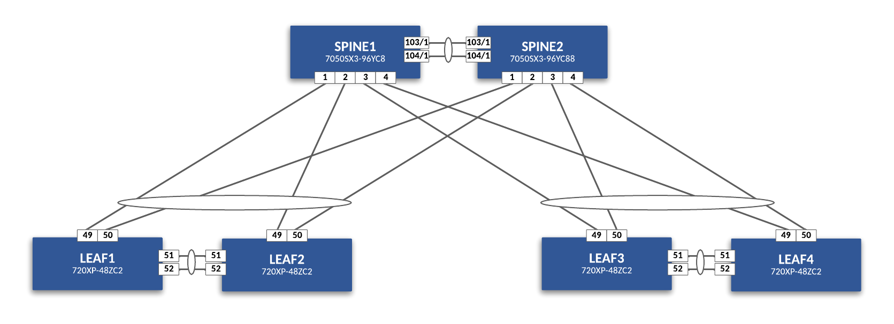

# Hello_ACT

The repository is aimed to give you a jumpstart in deploying your first ACT Lab. The lab also includes a basic AVD data model to deploy an simple L2LS against the topology.

## Topology

- 2 x SPINES (7050SX3-96YC8)
- 4 x LEAFS (720XP-48ZC2)



## Setting up the Tools Server node

There is a tools-server node included with the lab. It allows you to run VSCode as a container within the lab. From the tools-server node you can:

- Modify the AVD data model
- Generate configs and docs
- Push configs to switches via eAPI
- Push configs via CVP

### Running tools-server for the first time

The first time you start a lab you will need install AVD and set up ZSH (z-shell). Follow instructions [here](ACT/tools-server.md).

After install AVD and ZSH, you can start the shell by typing:

``` bash
zsh
```

From the terminal, you should land at a (zsh) prompt like below:

``` text
➜  /workspace git:(main) ✗
```

## AVD - Build & Deploy

From here you can build and deploy configs with the following make commands:

``` bash
# Build configs and docs
make build
```

``` bash
# Deploy configs to switches via eAPI
make deploy-eapi
```

``` bash
# Deploy configs to switches via CVP
make deploy-cvp
```
